# Claude Supervisor — Architecture

## Overview

Automates spinning up parallel Claude Code agents in isolated git worktrees,
each working on a separate task with a chosen model.

---

## Component Map

```
bin/supervisor.sh                  # Entry point — auto-init on first run, then orchestrates agents
bin/spawn-agent.sh                 # Spawns a single agent (branch + worktree + tmux + claude)
lib/utils.sh                       # Shared functions (sourced by both scripts)
templates/tasks.conf               # Scaffolded into target project on first run
templates/CLAUDE.md                # Scaffolded into target project .claude/ on first run
templates/.claude/settings.json    # PermissionRequest → Opus hook (scaffolded on first run)
templates/.claude/agents/          # Placeholder for custom subagents (scaffolded on first run)
```

### What the user actually runs

```
# First run — auto-init fires, project not yet set up:
supervisor.sh /path/to/project
→ scaffolds project/tasks.conf + project/.claude/ from templates/
→ prints "edit tasks.conf, then run again" → exits

# Every subsequent run — agents fire automatically:
supervisor.sh /path/to/project
→ reads project/tasks.conf
→ for each task line:
     git branch created automatically
     git worktree created at ../project-<branch>/
     .claude/ copied from project root into worktree
     tmux window opened and color-coded
     claude launched with the task, model, and mode
→ summary printed with attach instructions
```

The user never touches git branches, worktrees, or file copying.

---

## Flow Diagram

```mermaid
%%{init: {'flowchart': {'curve': 'linear'}}}%%
flowchart TD
    A(["supervisor.sh [repo_path · tasks.conf]\nrepo_path defaults to PWD"]) --> B[source lib/utils.sh]
    B --> C["check_deps()\nscan system for: git · tmux · npm · claude"]

    C --> C1{any tools\nmissing?}
    C1 -- no --> AK
    C1 -- yes --> C2["list all missing tools\n+ install instructions for each"]
    C2 --> C3{"auto-install\nmissing tools?"}
    C3 -- no --> C4[print instructions and exit]
    C3 -- yes --> C5["install in order:\nnvm → npm → claude · tmux"]
    C5 --> C6{install\nsucceeded?}
    C6 -- no --> C4
    C6 -- yes --> AK

    AK["resolve_api_key()"]
    AK --> AK1{ANTHROPIC_API_KEY\nenv var set?}
    AK1 -- yes --> AK4
    AK1 -- no --> AK2["prompt user\nread -s silent input"]
    AK2 --> AK4
    AK4["export ANTHROPIC_API_KEY\npassed explicitly to each tmux window"]

    AK4 --> FM

    FM["fetch_models() — called ONCE"]
    FM --> FM3["curl GET /v1/models"]
    FM3 --> FM4["parse JSON\njq if available · grep/sed fallback"]
    FM4 --> FM5[(AVAILABLE_MODELS array)]
    FM3 -- failure --> FM2a[warn + offer manual model entry]

    FM5 --> LOOP

    LOOP["for each task in tasks.conf\nbranch · model · mode · prompt"]

    LOOP --> BR{branch\nempty?}
    BR -- yes --> BR1["slugify(prompt) → branch_name"]
    BR -- no --> MD
    BR1 --> MD

    MD{model\nin config?}
    MD -- yes --> MO
    MD -- no --> MD1["show task description\n+ pick_model() menu\n← AVAILABLE_MODELS"]
    MD1 --> MO

    MO{mode?}
    MO -- normal --> SA
    MO -- plan --> SA

    SA["spawn-agent.sh\nrepo · branch · model · mode · prompt"]
    SA --> SA1[validate git repo]
    SA1 --> SA2["git worktree add\nskip if exists"]
    SA2 --> SA3["copy .claude/ dir from main repo\n(CLAUDE.md · agents/ · settings.json · hooks/)"]
    SA3 --> SA4{inside\ntmux?}
    SA4 -- yes --> SA5[new-window named branch_name]
    SA4 -- no --> SA6["new-session named\nrepo_name-agents"]
    SA5 --> SA7
    SA6 --> SA7

    SA7["setup_window()\nassign color from palette by agent index\nset tmux window color + title\nif Ghostty: set tab title via OSC escape"]

    SA7 --> SA8["print banner\ntask · branch · model · mode\n+ hint: /model to switch mid-session\n+ hint: update CLAUDE.md on corrections\n+ statusline shows context + git branch"]

    SA8 --> SA9{mode?}
    SA9 -- normal --> SA10[/"claude --model model_id"/]
    SA9 -- plan --> SA11[/"claude --model model_id --permission-mode plan"/]

    LOOP -- next task --> BR
    LOOP -- done --> END[git worktree list summary]
```



---

## Shared Utilities (lib/utils.sh)

| Function | Description |
|---|---|
| `check_deps` | Scans for all required tools; lists all missing ones with instructions; offers one-shot auto-install in correct dependency order |
| `resolve_api_key` | Checks `ANTHROPIC_API_KEY` env var; prompts via `read -s` if absent; passes explicitly to each tmux window — no reliance on inheritance |
| `fetch_models` | Hits Anthropic API once; populates `AVAILABLE_MODELS` array; `jq` if available, `grep`/`sed` fallback |
| `pick_model` | Shows task description + numbered model menu from `AVAILABLE_MODELS`; returns model ID — called per agent so user decides deliberately |
| `slugify "<text>"` | Converts free text to a valid git branch name |
| `setup_window <index> <mode>` | Assigns a color from palette by agent index; plan-mode gets a distinct color; sets tmux window color + title; sets Ghostty tab title via OSC escape if detected |

---

## Templates

The `templates/` directory contains files that are scaffolded into the target project on first run. **The user never edits anything in `templates/` directly.** All files are written to `<project>/` once and then owned by the user.

---

### `templates/tasks.conf` → `<project>/tasks.conf`

Read by the supervisor at runtime. The user defines one `[task]` block per agent. Only `prompt` is required — `branch`, `model`, and `mode` are optional. Agents never see this file — each agent IS one task block.

```ini
# Format: INI-style blocks
#
#   [task]
#   prompt = description of the task          (required)
#   branch = optional-branch-name             (default: auto-generated from prompt)
#   model  = optional-model-id                (default: prompted interactively)
#   mode   = normal | plan                    (default: normal)

# --- Plan phase (read-only agents, write the plan before any code changes) ---

[task]
mode   = plan
prompt = review the codebase and write a detailed implementation plan for OAuth2 login

[task]
mode   = plan
prompt = review the above plan as a staff engineer and flag risks or missing steps

# --- Execution phase (workers execute once the plan is approved) ---

[task]
branch = feature-auth
model  = claude-sonnet-4-5-20250929
prompt = implement the OAuth2 login flow per the approved plan

[task]
branch = fix-login-bug
model  = claude-haiku-4-5-20251001
prompt = fix the login session timeout bug

[task]
prompt = refactor the DB layer to use connection pooling
```

---

### `templates/CLAUDE.md` → `<project>/.claude/CLAUDE.md`

Copied into every worktree at agent spawn time. This is the project's memory — every agent reads it. The user fills in project specifics; the "Known Pitfalls" section grows over time as agents document corrections.

```markdown
# Project Memory
> After every correction, add a note to Known Pitfalls so the next agent doesn't repeat it.

## Project Overview
- What it does: <describe briefly>
- Stack: <language · framework · key libraries>
- Entry point: <e.g. src/main.ts>

## Conventions
- Style: <e.g. ESLint + Prettier>
- Tests: <e.g. Jest — run with: npm test>

## Known Pitfalls
- <example: never use process.env directly — use the config module in src/config.ts>

## Agent Instructions
- Always explain the WHY behind every change — reasoning and tradeoffs, not just what changed
- Use subagents for narrow isolated tasks — delegate to keep your main context clean
- Run tests before marking any task done
- Use /model to switch to a cheaper model once complex planning is complete
- Use /agents to see available subagents for this project
```

---

### `templates/.claude/settings.json` → `<project>/.claude/settings.json`

Copied into every worktree. Configures the `PermissionRequest` hook: when a cheap agent needs permission for a risky action, Opus evaluates it instead of interrupting the user.

```json
{
  "hooks": {
    "PermissionRequest": [
      {
        "hooks": [
          {
            "type": "prompt",
            "model": "claude-opus-4-6",
            "prompt": "A Claude agent on a cheaper model is requesting permission. Deny if destructive, irreversible without justification, or out of scope. Approve if clearly safe and aligned with the task. Return only JSON: {\"ok\": true} or {\"ok\": false, \"reason\": \"<why>\"}. Context: $ARGUMENTS",
            "timeout": 30
          }
        ]
      }
    ]
  }
}
```

---

### `templates/.claude/agents/` → `<project>/.claude/agents/`

Each `.md` file in this directory defines a **custom subagent** — a specialized Claude Code agent with its own system prompt, tool access, and description. Claude Code reads these automatically. Any agent can delegate narrow tasks to a subagent via the `Task` tool instead of handling everything in its own context.

Every worktree gets a copy of this directory, so all spawned agents share the same subagent pool.

**Shipped starter — `techdebt.md`:**

```markdown
---
name: techdebt
description: Use when asked to find technical debt, remove duplicated code, simplify over-engineered logic, or clean up dead code. Not for feature work.
tools: [Read, Glob, Grep, Edit, Write, Bash]
---

You are a senior engineer specializing in code quality and debt reduction.
Find duplicated logic, dead code, and over-engineered abstractions.
Consolidate without changing external behaviour.
Always explain WHY a change reduces debt. Run tests after each change.
```

**Other agents users can add:**

| File | Purpose |
|---|---|
| `code-reviewer.md` | Reviews changes for quality, security, and best practices |
| `test-writer.md` | Writes tests for a given function or module |
| `migration-planner.md` | Plans and writes database migrations |
| `security-reviewer.md` | Scans for OWASP issues and vulnerable patterns |

---

## Config File Format

INI-style blocks. Each `[task]` header starts a new agent. Only `prompt` is required.

```ini
[task]
prompt = description of the task          # required
branch = optional-branch-name             # default: auto-generated from prompt via slugify
model  = optional-model-id                # default: user is prompted with model menu
mode   = normal | plan                    # default: normal
```

---

## Plan Mode Workflow

For complex tasks the team pattern is:

1. **Planner agent** — spawned with `--permission-mode plan`; writes a detailed plan before touching any code
2. **Reviewer agent** — also in plan mode; reads the plan as a staff engineer and flags risks
3. **Worker agents** — spawned in normal mode to execute once the plan is approved
4. **Re-plan on failure** — if a worker goes sideways, spawn a new plan-mode agent to reassess before continuing

This is reflected in the `mode` config field. Plan mode agents use read-only tools and cannot modify files until the user approves the plan.

---

## CLAUDE.md as Agent Memory

When `spawn-agent.sh` creates a worktree it copies `CLAUDE.md` from the main repo root into the worktree. Each agent's banner includes the reminder:

> **Update CLAUDE.md if you make a correction — so the next agent doesn't repeat the same mistake.**

Over time, CLAUDE.md accumulates project-specific constraints, patterns, and known pitfalls that all agents inherit automatically.

---

## Model Selection and Credit Management

### Two separate model choices

Opus only activates for permission decisions — not for the actual agent work. There are two completely separate model choices happening:

**1. Agent model** — chosen by the user via `pick_model` before each agent spawns. This is the model that does the actual work: reading files, writing code, running commands. The user picks from the live model list fetched from `/v1/models`. There is no hardcoded default — the menu presents all available models and the user selects one per task.

**2. PermissionRequest hook model** — hardcoded to `claude-opus-4-6` in `settings.json`. This only fires when an agent needs permission for a potentially risky action. Opus evaluates the request for a few seconds and returns allow/deny. It does not run continuously.

Typical flow:
```
User picks Haiku for agent  →  agent does 95% of the work cheaply
         ↓
Agent tries to delete a file  →  PermissionRequest hook fires
         ↓
Opus evaluates for ~2s: "is this safe given the task?"  →  allow / deny
         ↓
Agent continues on Haiku
```

Opus is the gatekeeper on risky actions, not the worker. The point is to keep the bulk of compute on cheap models while using Opus only where its judgement actually matters.

---

### Agent model menu

`pick_model` is called **per agent** when no model is specified in the config. Before showing the menu, the agent's task description is displayed so the user can make an informed decision:

```
Task : fix the login timeout bug
Branch: fix-login-bug

Available models:
  1) claude-haiku-4-5-20251001     — fastest · cheapest
  2) claude-sonnet-4-5-20250929    — balanced
  3) claude-opus-4-6               — most capable · most expensive

Select model for this agent [1]: _
```

To switch models **mid-session** inside an active agent, use the `/model` command in the claude prompt. This is noted in the banner so users are aware they can downgrade to a cheaper model once a complex planning phase is done.

---

## Subagents & Hooks

### Two levels of agents

Agents in this system operate at two levels:

| Level | What it is | Who manages it |
|---|---|---|
| **Supervisor level** | Each task spawned by `supervisor.sh` is an independent Claude Code process | The supervisor script |
| **Within each agent** | That agent can itself spawn subagents for narrow sub-tasks via the `Task` tool | Claude Code internally |

The second level is free — Claude Code handles it automatically. We support it by:
1. Copying `.claude/agents/` from the main repo into each worktree so custom subagent definitions are available
2. Including an instruction in the CLAUDE.md template: *"Use subagents for narrow, isolated tasks. Delegate to keep your main context clean."*
3. Banner hint: `subagents available — use /agents to view`

### Permission routing via PermissionRequest hook

This is the concrete implementation of "route permission checks to Opus":

**The pattern:**
- Worker agent runs on Haiku or Sonnet (cheap, fast)
- Before a risky tool call fires, the `PermissionRequest` hook intercepts the permission dialog
- The hook uses `type: "prompt"` with `model: "claude-opus-4-6"` to ask Opus whether to allow or deny
- Opus evaluates the action in context and returns `{ "ok": true }` or `{ "ok": false, "reason": "..." }`
- Result: cheap model does 95% of the work, Opus only activates on trust decisions

**What the hook looks like (`templates/.claude/settings.json`):**
```json
{
  "hooks": {
    "PermissionRequest": [
      {
        "hooks": [
          {
            "type": "prompt",
            "model": "claude-opus-4-6",
            "prompt": "A Claude agent is requesting permission to use a tool. Evaluate if this action is safe and appropriate given the task context. Deny if it looks destructive, out of scope, or risky. Context: $ARGUMENTS",
            "timeout": 30
          }
        ]
      }
    ]
  }
}
```

**How it reaches each agent:**
`spawn-agent.sh` copies the full `.claude/` directory from the main repo into the worktree. The auto-init step scaffolds `settings.json` from `templates/` into the project on first run, so every agent inherits the hook automatically.

### Other useful hooks (extension points)

| Hook | Use case |
|---|---|
| `PostToolUse` (Write/Edit) | Auto-run linter or tests after file changes |
| `Stop` | Block agent from stopping until tests pass |
| `TaskCompleted` | Enforce quality gates before a task closes |
| `PreCompact` | Save a summary before context is compacted |
| `SessionEnd` | Log session stats or notify on completion |

These are not implemented by the supervisor — they live in the project's `.claude/settings.json` and travel with each worktree automatically.

---

## Terminal Setup

### Detection
`setup_window` detects the terminal at runtime:
- `$TERM_PROGRAM == "ghostty"` → Ghostty is active
- `$TMUX` set → inside a tmux session
- Anything else → plain terminal fallback (colors via ANSI only)

### Color-coded windows
Each agent window gets a color assigned by index from a fixed palette defined in `utils.sh`. Plan-mode agents always get **yellow** to visually distinguish them from workers.

| Agent index | tmux color | Ghostty tab |
|---|---|---|
| 0 | `colour33` (blue) | OSC `\033]0;branch\007` |
| 1 | `colour70` (green) | same |
| 2 | `colour166` (orange) | same |
| plan mode | `colour220` (yellow) | same |
| ... | cycles through palette | same |

Ghostty tab title is set via standard OSC 0 (`\033]0;title\007`) which Ghostty supports natively. Color per tab is not forced — the color-coding lives in tmux windows, visible when tiling or switching.

### Statusline
The Claude Code `/statusline` feature (shows context usage + git branch at the bottom of each session) is a **one-time global config** — set it once with `/statusline` in any claude session and it applies everywhere. The agent banner includes a reminder for users who haven't configured it yet.

---

## Key Design Decisions

- `check_deps` scans everything upfront, reports all missing tools at once, installs in correct dependency order (nvm → npm → claude)
- User has **one decision point** for installs — auto or manual — not one per tool
- `resolve_api_key` uses `read -s` for silent input; key is passed **explicitly** to each tmux window, not relying on environment inheritance
- `repo_path` defaults to `$PWD` — no argument needed if running from inside the project
- `fetch_models` is called **once** per supervisor run — list is reused for all `pick_model` calls
- `pick_model` is called **per agent** intentionally — user decides model per task to manage credit consumption
- `/model` mid-session switching is surfaced in the banner for in-flight credit management
- The full `.claude/` directory is copied into every worktree — agents inherit CLAUDE.md memory, custom subagent definitions, and hook configs
- `PermissionRequest` hook routes permission decisions to Opus — cheap models work, Opus decides on risky actions
- Plan mode agents write and review plans before any code is written — workers execute after approval
- `setup_window` detects Ghostty vs tmux at runtime — no hard dependency on either
- Plan-mode windows are always yellow — visually distinct from worker windows
- `/statusline` is a one-time global config; not managed per-agent
- `spawn-agent.sh` is independently testable without the supervisor
- All logic shared between scripts lives in `lib/utils.sh`
